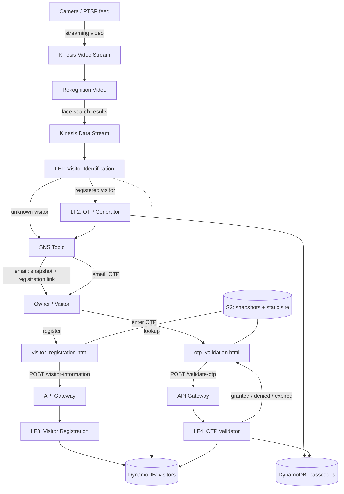

<div align="center">

# 🚪 Smart Door Authentication System

### Serverless, cloud-based facial-recognition access control on AWS

Real-time visitor identification with **Kinesis Video Streams + Rekognition**, an
event-driven **Lambda** workflow, **OTP-based** entry for known visitors, and an
automated **owner-approval** flow for unknown ones.

`Amazon Kinesis` · `Amazon Rekognition` · `AWS Lambda` · `Amazon DynamoDB` · `Amazon SNS` · `API Gateway` · `Amazon S3` · `Python`

</div>

---

> **Course project** — ECE 528: Cloud Computing, University of Michigan–Dearborn.

## Overview

This system replaces physical keys and PINs with cloud-powered facial authentication. A camera streams live video to AWS; Rekognition identifies faces in real time; and an event-driven Lambda pipeline decides what happens next:

- **Known, registered visitor** → a one-time passcode (OTP) is emailed to them; they enter it on a web page to unlock the door.
- **Unknown visitor** → the owner is notified by email with a snapshot and a registration link, and can register the visitor to grant future access.

The whole thing is serverless and event-driven, so it scales automatically and only bills per use.

## Architecture



### Workflow

1. A camera streams footage to **Kinesis Video Streams (KVS)**.
2. **Rekognition Video** analyses the stream and writes face-search results to a **Kinesis Data Stream**.
3. **LF1** consumes those results and branches on the outcome (unknown / known-unregistered / registered).
4. OTPs are generated by **LF2**, stored in DynamoDB with a TTL, and delivered via **SNS** email.
5. Visitors interact through two **S3-hosted static pages** backed by **API Gateway + Lambda**.

## Components

### Lambda functions (`lambdas/`)

| File | Role | Trigger |
|------|------|---------|
| `lf1_visitor_identification.py` | Decides the workflow for each detected face | Kinesis Data Stream |
| `lf2_otp_generator.py` | Generates a 4-digit OTP, stores it with a 5-min expiry, emails it | Invoked by LF1 |
| `lf3_visitor_registration.py` | Registers a visitor and marks them authorized | `POST /visitor-information` |
| `lf4_otp_validator.py` | Validates a submitted OTP and returns the access decision | `POST /validate-otp` |

### Web pages (`web/`)

| File | Purpose |
|------|---------|
| `visitor_registration.html` | Captures visitor name + email, posts to `/visitor-information` |
| `otp_validation.html` | Visitor enters OTP, posts to `/validate-otp`, shows Granted / Invalid / Expired |

### DynamoDB tables

| Table | Key | Attributes |
|-------|-----|------------|
| `visitors` | `faceId` | `name`, `email`, `authorized`, `photoKey`, `registeredAt` |
| `passcodes` | `passcode` | `faceId`, `expires` (epoch seconds) |

### API endpoints

| Method & path | Lambda | Body |
|---------------|--------|------|
| `POST /visitor-information` | LF3 | `{ "faceId": "...", "name": "...", "email": "...", "fileName": "..." }` |
| `POST /validate-otp` | LF4 | `{ "passcode": "...." }` |

## Configuration

The Lambda functions read all account-specific values from **environment variables** — no secrets or ARNs are hard-coded. See `.env.example` for the full list. Key variables:

| Variable | Used by | Example |
|----------|---------|---------|
| `VISITORS_TABLE` | all | `visitors` |
| `PASSCODES_TABLE` | LF2, LF4 | `passcodes` |
| `SNS_TOPIC_ARN` | LF1, LF2 | `arn:aws:sns:us-east-1:<acct>:smartdoor-otp` |
| `BUCKET` | LF1 | `my-smartdoor-bucket` |
| `SEND_OTP_LAMBDA` | LF1 | `smartdoor-send-otp` |
| `WEBSITE_BASE` | LF1 | `http://my-smartdoor-bucket.s3-website-us-east-1.amazonaws.com` |
| `OTP_TTL_SECONDS` | LF2 | `300` |

In the two web pages, set the `API_URL` constant near the top of each file to your API Gateway invoke URL.

## Deployment

1. **DynamoDB** — create the `visitors` and `passcodes` tables with the keys above. (Optional: enable TTL on `passcodes.expires`.)
2. **S3** — create a bucket, enable static website hosting, and upload the two files from `web/`.
3. **SNS** — create a topic (e.g. `smartdoor-otp`) and subscribe the owner's email.
4. **Lambda** — create one function per file in `lambdas/`, Python 3.12 runtime, and set the environment variables. Give each function an IAM role with least-privilege access to the services it touches (DynamoDB, SNS, S3, `lambda:InvokeFunction` for LF1→LF2).
5. **API Gateway** — create the two `POST` routes, integrate them with LF3 / LF4, and **enable CORS** so the S3-hosted pages can call them.
6. **Kinesis + Rekognition** — create a Video Stream, a Rekognition stream processor subscribed to it, and a Data Stream as the processor's output; wire that Data Stream to trigger LF1. See `streaming/kvs_streaming_commands.md` for the camera-to-KVS commands.

## Security

- **Never commit AWS keys.** Credentials should come from IAM roles (for Lambda) or environment variables / `aws configure` (for local tools) — never inline in code or shell commands. `.gitignore` already excludes `.env` and credential files.
- Scope each Lambda's IAM role to **least privilege**.
- OTPs are short-lived (default 5 minutes) and validated server-side, including an expiry check.
- Lock down the public S3 site and API Gateway CORS to the specific origin in production rather than `*`.

## Results (from testing)

- Known visitors were correctly identified under normal lighting and received OTPs by email within seconds of detection.
- Unknown visitors triggered owner-notification emails with a working registration link that updated DynamoDB on submission.
- The OTP validation endpoint returned correct Granted / Invalid responses across test cases.

## Repository structure

```
smart-door-authentication/
├── README.md
├── .gitignore
├── .env.example
├── requirements.txt
├── lambdas/
│   ├── lf1_visitor_identification.py
│   ├── lf2_otp_generator.py
│   ├── lf3_visitor_registration.py
│   └── lf4_otp_validator.py
├── web/
│   ├── visitor_registration.html
│   └── otp_validation.html
└── streaming/
    └── kvs_streaming_commands.md
```

## Possible improvements

- Multi-camera support and zone-based access.
- Native DynamoDB TTL on `passcodes` for automatic OTP cleanup.
- Rate limiting / lockout after repeated failed OTP attempts.
- Audit dashboard for access logs.

## Author

**Rishi Gnanasekar** — MS Data Science, University of Michigan
[LinkedIn](https://linkedin.com/in/rishi-gnanasekar-10j03/) · [GitHub](https://github.com/Rishisekar1610)
